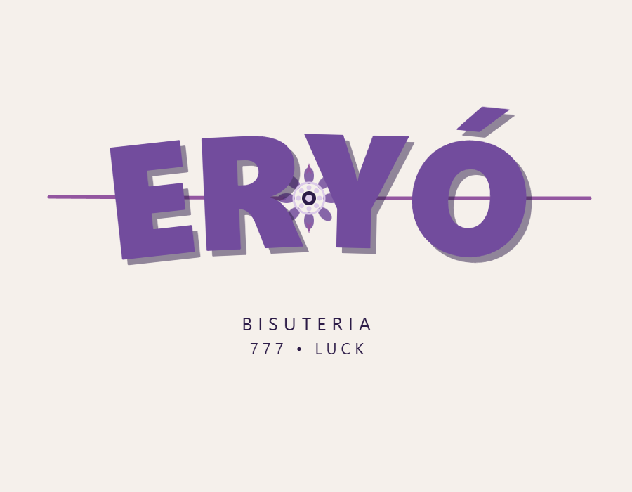

# Eryó — Bisutería Artesanal



Eryó es una plataforma de comercio electrónico diseñada para una tienda de bisutería artesanal en Barranquilla, Colombia. La aplicación permite a los usuarios navegar por un catálogo de manillas, anillos, collares y aretes, agregar productos a un carrito, realizar pedidos de pago contraentrega y solicitar cotizaciones para piezas de joyería personalizadas creadas a partir de hilos, tejidos y dijes específicos.

Este monorepositorio incluye tanto el **Frontend** (Next.js 15) como el **Backend** (FastAPI).

## Arquitectura del Proyecto

El proyecto está dividido en dos partes principales:

- `frontend/`: Aplicación React construida con Next.js 15 App Router, estilizada con Tailwind CSS. Orientada al consumido final y diseñada con enfoque "Mobile-first" para un uso tipo App Nativa.
- `backend/`: API construida con FastAPI (Python), gestionando una base de datos local SQLite y los archivos multimedia utilizando integraciones en la nube.

## Requisitos Previos

- **Node.js**: `v20` o superior (para el frontend).
- **Python**: `v3.10` o superior (para ejecutar el servidor local FastAPI).

## Instalación y Configuración

### 1. Backend (FastAPI)

1. Abrir una terminal en `backend/`.
2. Crear un entorno virtual e instalar las dependencias:
   ```bash
   python -m venv venv
   source venv/Scripts/activate # Windows (o source venv/bin/activate en Mac/Linux)
   pip install -r requirements.txt
   ```
3. Copiar `.env.example` a `.env` (si existe) y configurar variables si aplican.
4. Ejecutar el servidor uvicorn en tu red local:
   ```bash
   uvicorn app.main:app --reload --host 0.0.0.0 --port 8000
   ```
   > El API se desplegará localmente en `http://localhost:8000`

### 2. Frontend (Next.js)

1. Abrir una nueva terminal en `frontend/`.
2. Instalar dependencias a través del manejador de paquetes de Node:
   ```bash
   npm install
   ```
3. Configurar tus variables de entorno locales (`.env.local`):
   ```env
   # Asegúrate de apuntar a la IP local de tu computador si quieres probar el sitio desde tu celular en la misma red Wi-Fi
   NEXT_PUBLIC_API_URL=http://192.168.1.13:8000
   ```
4. Iniciar el servidor local:
   ```bash
   npm run dev -- --hostname 0.0.0.0
   ```

## Características Clave

- **Responsive Mobile First**: La tienda está altamente estructurada para mostrar componentes estilo App cuando es navegada desde un móvil celular (como una barra de navegación inferior, filas deslizable contenidas, y ocultamiento dinámico).
- **Control de Carrito Integral**: Context API global usado en react para controlar el número de insumos pedidos, sincronizándolo continuamente en `localStorage`.
- **Creador Personalizado**: Un formulario para que el usuario construya su pieza personalizada sumando tipos de hilo, tejidos y estilos de los componentes disponibles listados por la API.
- **Panel Administrativo (`/admin`)**: Sistema de gestión con validación y subidad de imágenes en Cloudinary para crear y activar inventarios.

---
_Desarrollado para Eryó. 2026._
